<div align="center">

# Armada

**一个面板管理你所有的 Kubernetes 集群**


多集群 Kubernetes 管理面板：资源查看走本地缓存（毫秒级），写操作直连 API Server，
按「集群 × 模块 × 读写」做细粒度授权，浏览器内直连容器终端。

</div>

---

## 目录

- [它解决什么问题](#它解决什么问题)
- [功能截图](#功能截图)
- [核心设计](#核心设计)
- [功能清单](#功能清单)
- [技术栈](#技术栈)
- [安装部署](#安装部署)
- [项目结构](#项目结构)
- [API 路由](#api-路由)
- [已知限制](#已知限制)

---

## 它解决什么问题

管理多套 K8s 集群时，几个绕不开的麻烦：

**1. `kubectl config use-context` 来回切，还容易切错**
手上握着好几份 kubeconfig，每次查东西先切上下文，切错了就在错误的集群上执行了操作。
Armada 把集群导入后统一在一个面板里切换，当前集群始终显示在顶栏。

**2. 大集群 `kubectl get pods -A` 慢得没法用**
本项目的测试集群有 250+ 节点、16000+ Pod，一次全量拉 Pod 列表要 **4 分钟**、响应体 **168MB**，
而且传输中途经常被网络截断（`IncompleteRead`）。
Armada 用后台线程按周期把资源同步进本地库，页面读缓存 —— 同一集群同一份数据，实测差距：

| 资源 | 条数 | 直连 API Server | 读本地缓存 |
|---|---:|---:|---:|
| Pod | 16765 | 259.6 s | **17.8 ms** |
| Deployment | 154 | 4.30 s | **0.8 ms** |
| Service | 283 | 0.47 s | **0.3 ms** |

> 注：Pod 那一行的 259.6 s 包含分页拉取的 34 次请求往返；数字随集群规模变化，
> 这里给的是实测值而非理论值。写操作（扩缩容 / 重启 / 删除 / 回滚）一律直连
> API Server，不读缓存，避免拿旧状态做决策。

**3. 想给同事开权限，但 K8s RBAC 太重**
写 Role / RoleBinding、发 ServiceAccount token、还要让对方装 kubectl。
Armada 内置一层应用级授权：按**集群 × 模块 × 读写**授权，13 个模块独立控制，
只读用户在界面上看不到写操作入口，后端接口也会拦（两侧都拦，缺一不可）。

**4. 排查问题要在终端和面板之间来回跳**
看日志、进容器、改 YAML 各是一套命令。Armada 把这些收进界面：
Pod 日志直接看，容器终端浏览器里开，YAML 在线编辑且提交前走 K8s 真实 dry-run 校验。

---

## 功能截图

> 截图放在 [`docs/screenshots/`](docs/screenshots/)，命名规范见该目录的
> [README](docs/screenshots/README.md)。GitHub 会自动渲染相对路径图片，无需额外配置。

### 仪表盘

接入 Prometheus 时展示 CPU / 内存 / GPU 指标；没有 Prometheus 则依次降级到
Metrics Server、Pod requests 聚合，不会直接空着。

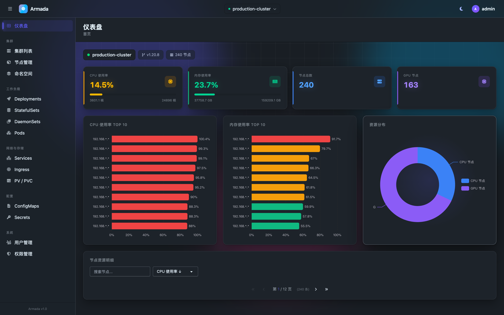

### 集群与节点

| 集群列表 | 节点管理 | 节点详情 |
|:---:|:---:|:---:|
| 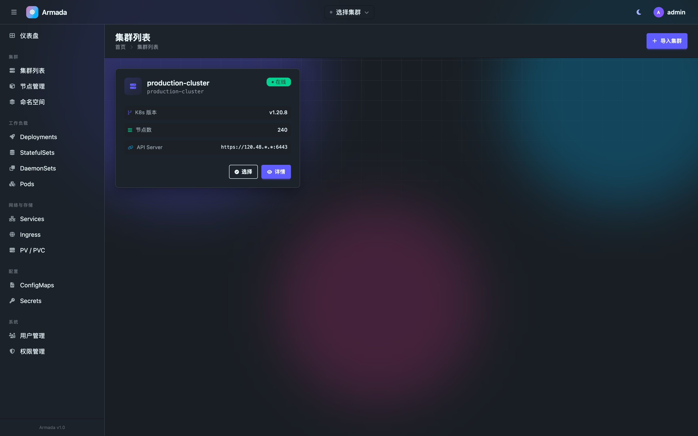 | 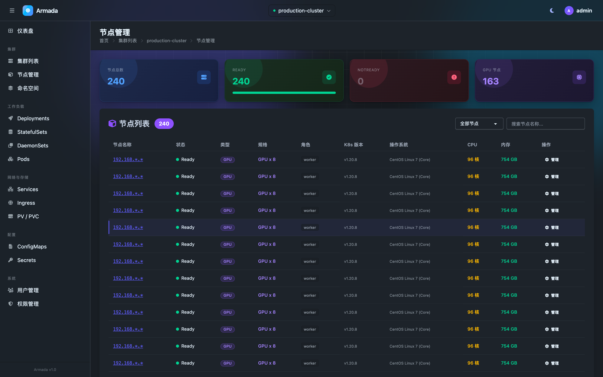 | 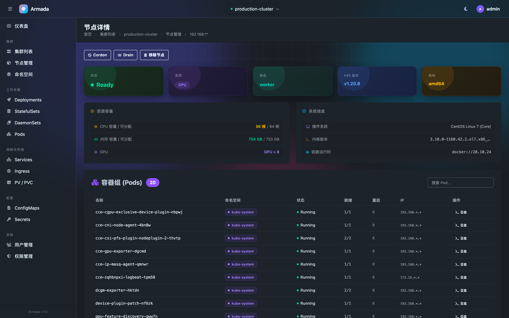 |
| 多集群一键切换，kubeconfig 加密存储 | Cordon / Uncordon / Drain | 容量、负载与该节点上的 Pod |

### 容器终端与日志

浏览器内直连容器 shell，不用装 kubectl。

| 容器终端 | Pod 日志 | Pod 列表 |
|:---:|:---:|:---:|
| 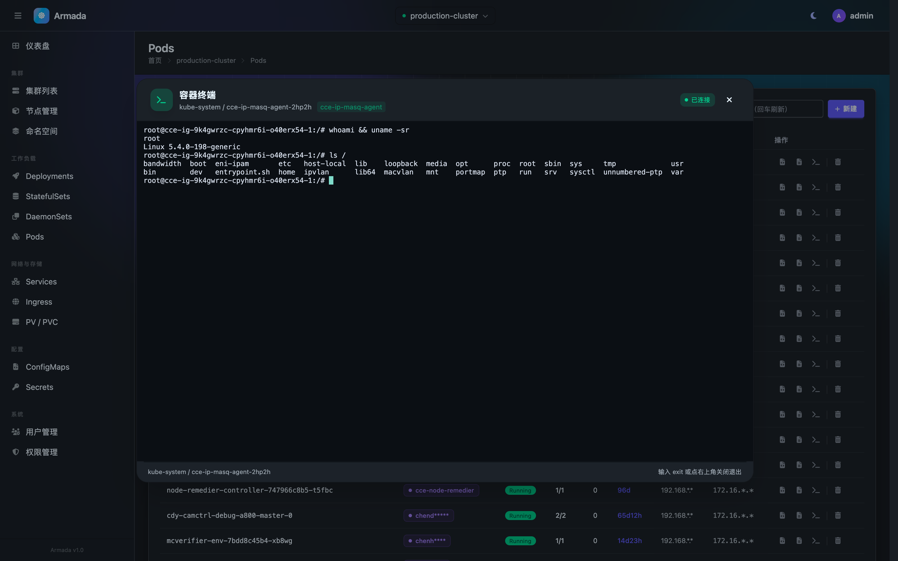 | 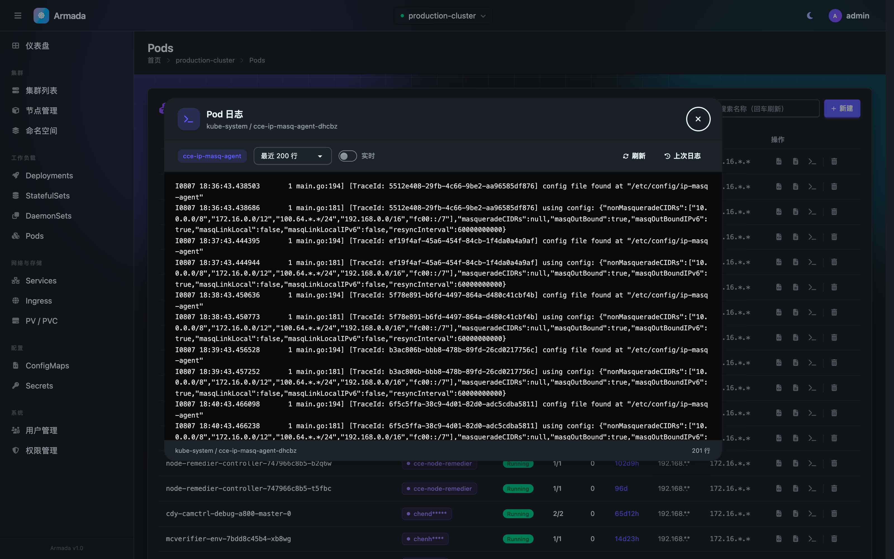 | 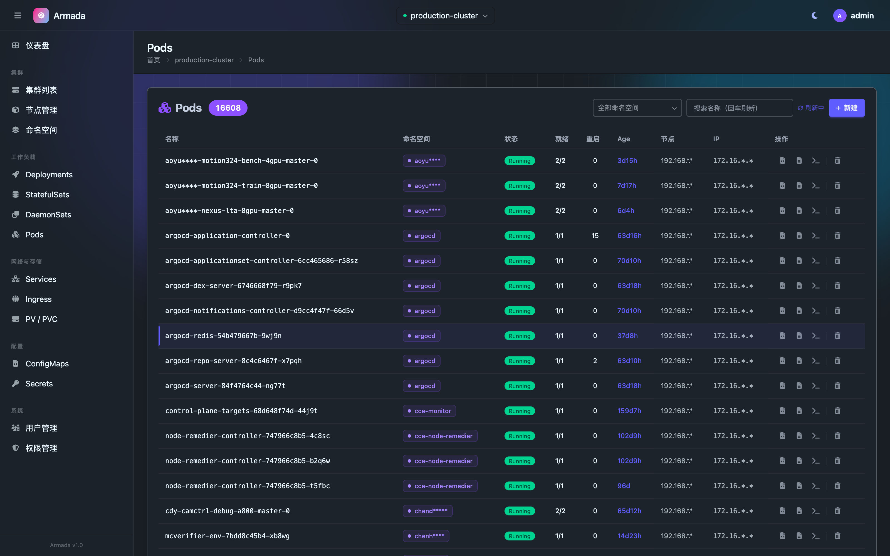 |
| 自动选 bash / sh，支持窗口 resize | 实时刷新 / 上次日志 / tail 行数 | 容器层卡点 reason 高亮 |

### 工作负载管理

| Deployment 列表 | 详情（Events + 关联 Pods） | 回滚到历史版本 |
|:---:|:---:|:---:|
| 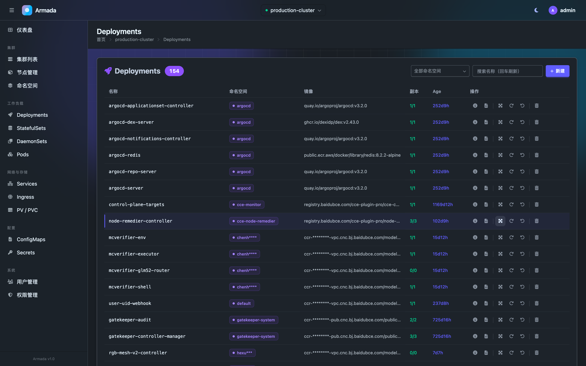 | 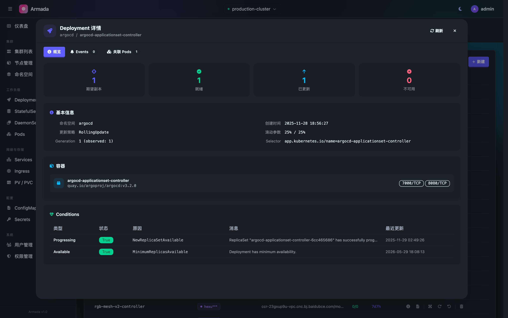 | 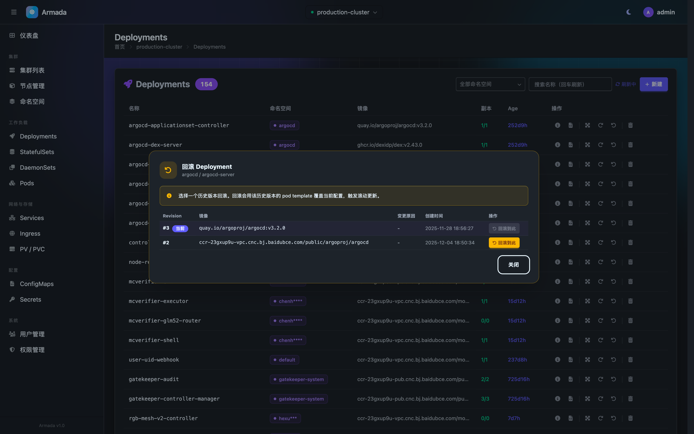 |
| 扩缩 / 重启 / 回滚 / 删除 | 概览、Events、关联 Pods 分页 | 列出历史 revision，一键回滚 |

### YAML 编辑与校验

| 在线编辑（默认只读） | dry-run 校验 |
|:---:|:---:|
| 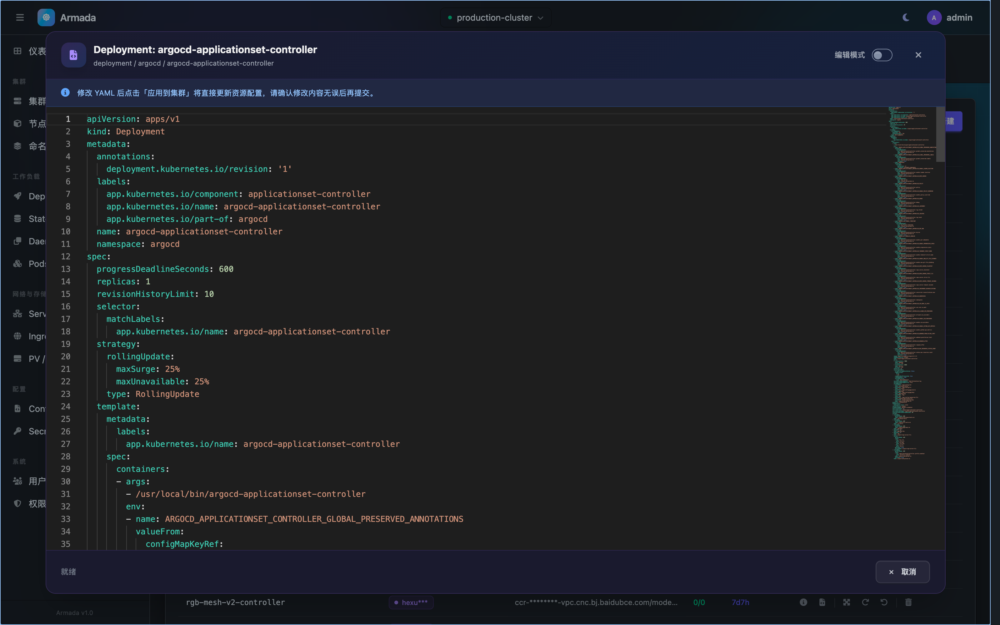 | 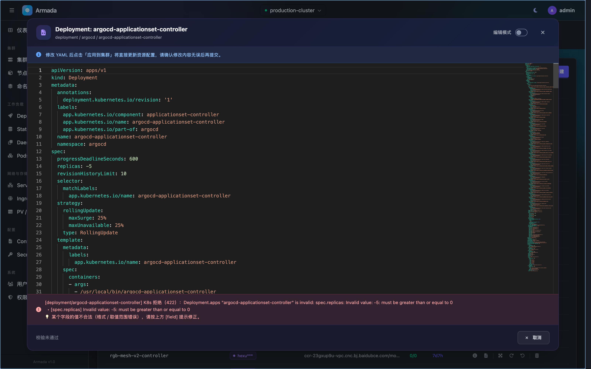 |
| Monaco 编辑器，按开关进入编辑模式 | 调 K8s 真实 server-side dry-run，报错翻译成中文并给出处置建议 |

### 用户与权限

| 权限管理 | 用户管理 | 登录 |
|:---:|:---:|:---:|
| 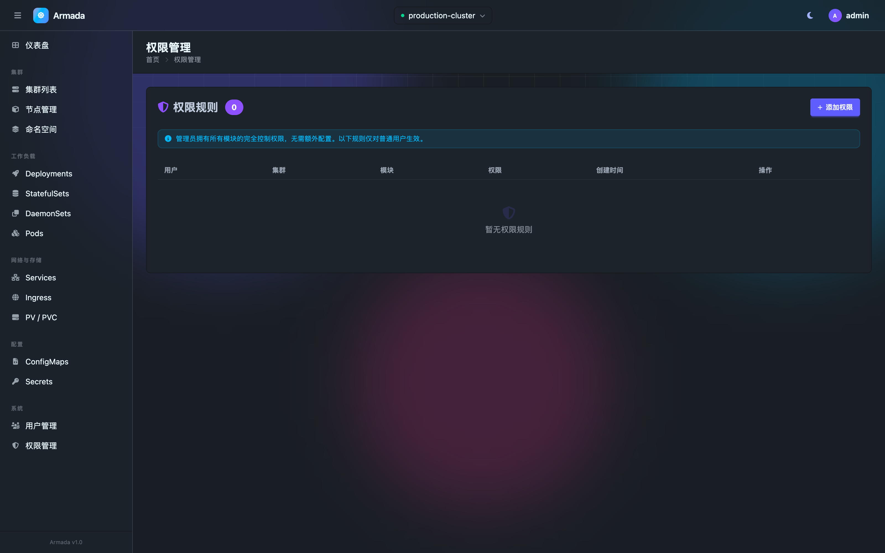 | 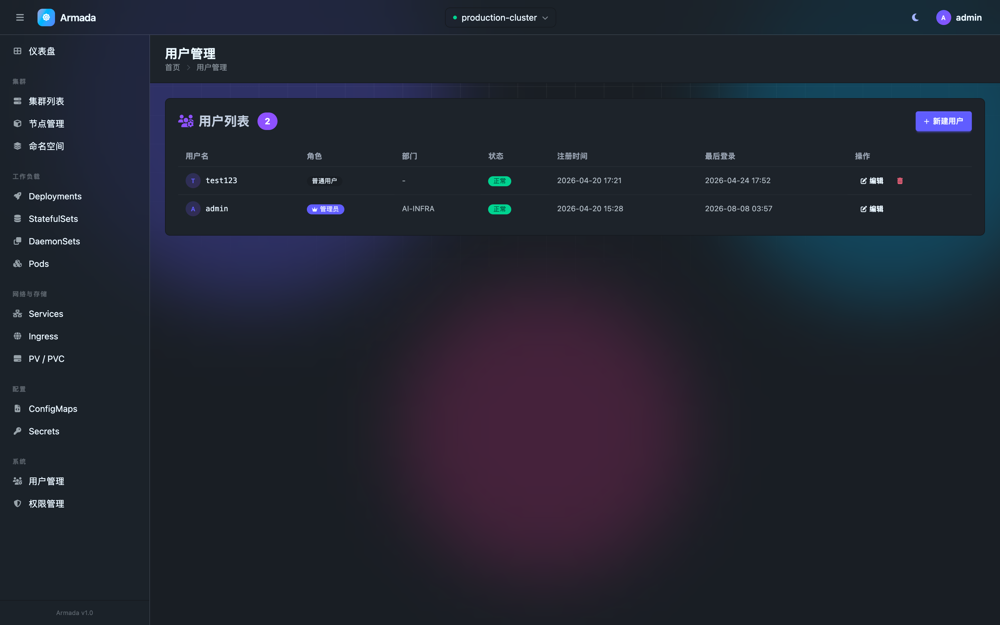 | 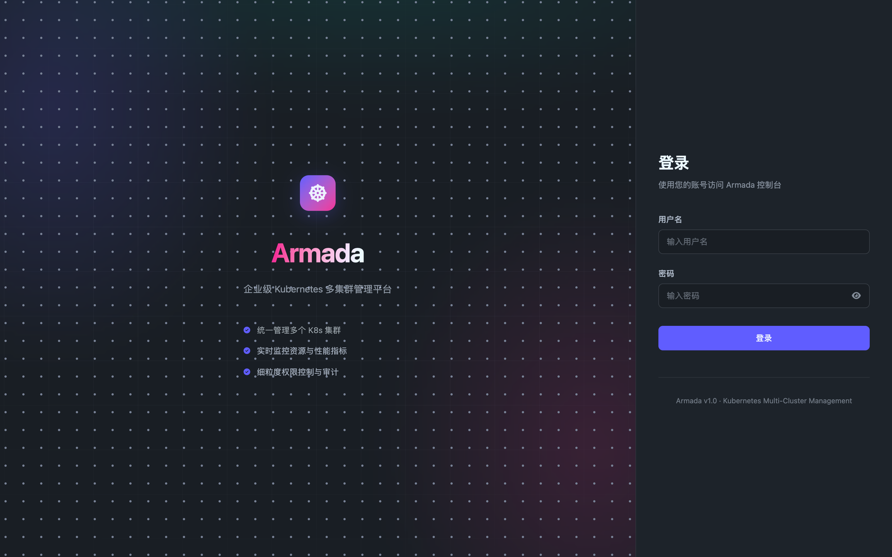 |
| 按集群 × 模块 × 读写授权 | 管理员 / 普通用户，可禁用账户 | 账户禁用提示、CSRF 失效友好回登录 |

---

## 核心设计

### 读缓存、写直连

后台为每个集群起一个守护线程，每 **60 秒**按固定顺序同步 10 类资源：

```
namespace → pod → deployment → service → configmap
→ secret → ingress → persistentvolumeclaim → statefulset → daemonset
```

- 缓存落在**单张表** `K8sResourceCache`，唯一键 `(cluster_id, resource_type, namespace)`，
  整个资源类型的列表序列化进一个 JSON 字段，每轮**全量替换** —— 不做增量 diff，
  省掉一整类「删掉的资源没清理干净」的 bug。
- 同步锁是**按资源类型**的，周期同步和写操作触发的立即同步在资源粒度互斥，
  互不阻塞（改了 Deployment 不会卡住 Pod 的同步）。
- 单类资源同步失败不中断整轮，错误记进 `_sync_last_error` 由前端透出
  「集群连接异常，列表数据可能不是最新的」横幅，而不是让页面假装数据是新的。

### 大集群列表用 chunked list 分页

一次性拉全量在大集群上会失败：测试集群的 Pod 列表单响应体达 **168MB**，
传输中途连接被断，报 `IncompleteRead`。加大超时没用 —— 响应越大越容易被截断。

改走 K8s 原生的 chunked list：每页 500 条，靠 `continue` token 往下翻，
单个响应从百 MB 级降到几 MB。翻页途中 token 过期（410 Gone）会从头重来一次，
另设 5 万条上限作为保险丝，超过则截断并标记，避免异常集群把内存吃穿。

### 三种工作负载的回滚机制并不相同

这一点容易踩坑，Armada 分别实现：

| 资源 | 历史版本来源 | 定位当前版本 |
|---|---|---|
| Deployment | ReplicaSet | `deployment.kubernetes.io/revision` annotation |
| StatefulSet | ControllerRevision | `status.update_revision`（完整 CR 名） |
| DaemonSet | ControllerRevision | 无对应字段，需从 Pod 上的 `controller-revision-hash` 取众数 |

回滚统一用 **JSON Merge Patch** 只改 `spec.template`，不整体 replace ——
这样 K8s 控制器能复用已有的 ReplicaSet，不会每次回滚都堆出一个新的。

DaemonSet 那一行是实际踩过的坑：它既没有 `status.update_revision`，
Pod label 里存的又是**裸 hash**（`6fd988788d`），而 ControllerRevision 的名字是
`<名称>-<hash>`，直接相等比较永远不成立。

### 容器终端：服务端持有连接 + HTTP 轮询

K8s 的 exec 本身是 WebSocket 协议。但本项目跑在 WSGI 上（没装 channels/daphne），
要让浏览器 WebSocket 直通 K8s，得把部署整体改成 ASGI 全栈。

选择让 Django 进程持有那条到 K8s 的 WebSocket，浏览器侧用 HTTP 短轮询收发字节：
**零部署改造**，代价是输入到回显多一个轮询周期的延迟。单次轮询最多阻塞 0.6 秒，
一有输出立刻返回；一次往返结束后立即发起下一次，而不用 `setInterval`（定时器会让请求叠住）。

安全上三道约束：

1. 四个端点全是 POST 且挂在 `/resources/<pk>/pods/` 前缀下，
   自动落到权限中间件的 **pod 模块 + edit 权限**校验（进了 shell 等价于对该 Pod 完全控制）。
2. 会话 token 与创建者 `user_id` 绑定，换个用户拿到 token 也用不了。
3. 会话有 5 分钟空闲超时和 32 个总数上限，泄漏的会话不会一直占着 K8s 连接。

### 权限模型

两层中间件：`LoginRequiredMiddleware` 全局拦登录，`PermissionMiddleware` 做模块级校验。

- 授权粒度：**用户 × 集群 × 模块 × 读写**，唯一约束 `(user, cluster, module)`
- 13 个模块：`dashboard` `cluster` `node` `namespace` `deployment` `statefulset`
  `daemonset` `pod` `service` `ingress` `configmap` `secret` `pvc`
- 权限类型：`view`（只读）/ `edit`（含删除）
- 中间件按 URL 前缀反查模块，POST 一律视为写操作，需要 `edit`
- 校验结果注入 `request.user_can_edit`，模板据此隐藏写操作入口；
  **接口侧独立校验**，不依赖前端隐藏
- 失败响应区分请求类型：AJAX 返回 JSON 403，页面请求渲染 403 页

### 其他实现细节

- **kubeconfig 加密存储**：Fernet 对称加密，密钥走环境变量 `KUBECONFIG_ENCRYPTION_KEY`，
  加解密封在模型层（`set_kubeconfig` / `get_kubeconfig`），数据库里存的是密文
- **客户端连接池**：按集群缓存 `ApiClient`（单例 + double-check 加锁），
  避免反复解析 kubeconfig 和重建 TLS 连接。
  exec 这类 WebSocket 调用**必须用独立 client** —— `kubernetes.stream()` 会临时替换
  `api_client.request`，共享 client 会导致其他线程的普通请求被送进 WebSocket 实现
  （实测并发下 60 次 list 有 3 次因此失败）
- **Drain 走真正的 eviction API**（`policy/v1` Eviction），自动跳过 DaemonSet Pod
  和镜像 Pod，并在节点上打 `armada.io/drained-at` 注解区分 cordon 与 drain
- **Prometheus 指标带标签兼容层**：不同 exporter 的节点标签不一致
  （`node` / `instance` / `Hostname` / `kubernetes_node`），逐个尝试匹配；
  GPU 优先读 DCGM，降级到 nvidia_smi_exporter
- **YAML 校验调真实 dry-run**（`dry_run=All`，走完整 admission 链路但不落库），
  报错经两层处理：先从 K8s Status 里抽 `message` + `causes`，再按状态码和关键词
  分成 8 类给出中文处置建议（如 422 + immutable → 「该字段创建后不可改，请删除后重建」）

---

## 功能清单

### 多集群管理
- kubeconfig 导入 / 编辑集群，凭据加密存储
- 集群状态（在线 / 离线）后台探测刷新，展示 K8s 版本、节点数、API Server
- 顶栏一键切换当前集群

### 资源管理

| 分类 | 资源 |
|---|---|
| 工作负载 | Deployment、StatefulSet、DaemonSet、Pod |
| 网络 | Service、Ingress |
| 配置 | ConfigMap、Secret |
| 存储 | PersistentVolumeClaim |
| 其他 | Namespace |

支持的操作：

- **查看**：列表、详情弹窗（概览 + Events + 关联 Pods）、YAML 查看
- **写入**：扩缩容（patch scale 子资源）、重启（打 `kubectl.kubernetes.io/restartedAt` 注解）、
  回滚到历史 revision、在线编辑 YAML、通过 YAML 模板新建、删除（含级联警告）
- **诊断**：Pod 日志（可选 tail 行数 / 上次日志 / 3 秒自动刷新）、容器终端、
  容器层卡点 reason 高亮（`ImagePullBackOff` 等）
- **节点**：Cordon / Uncordon / Drain / 移除

### 用户与权限
- 管理员 / 普通用户两种角色
- 按集群 × 模块 × 读写的细粒度授权
- 账户可禁用；密码走 Django 内置四项校验器
- 登录失败对「密码错误」和「账户禁用」区分提示，但不暴露用户名是否存在

---

## 技术栈

| 层级 | 选型 |
|---|---|
| 后端 | Django 6.0.4 / Python 3.12 |
| 数据库 | SQLite（默认，零配置）· PostgreSQL（设 `DB_ENGINE=postgresql` 切换） |
| K8s 接入 | Kubernetes Python Client v35 |
| 监控 | Prometheus（可选）· Metrics Server（降级）|
| 前端 | Django Templates + Alpine.js（轻 HTML 骨架 + JSON API） |
| 样式 | Tailwind CSS 4.2 + DaisyUI 5.5 |
| 图表 | ECharts |
| 终端 | xterm.js 5.5 + fit 插件 |
| 编辑器 | Monaco Editor |
| 动效 | GSAP + 移植自 [vue-bits](https://github.com/DavidHDev/vue-bits) 的组件 |
| 加密 | Fernet（cryptography） |

前端依赖除 Monaco 外全部本地 vendor，不依赖 CDN 可用性。

---

## 安装部署

### 环境要求

- Python 3.10+（开发环境用 3.12）
- Node.js 18+（编译 Tailwind）
- 至少一份可用的 kubeconfig

### 步骤

```bash
# 1. 安装 Python 依赖
python -m venv venv && source venv/bin/activate
pip install django==6.0.4 kubernetes==35.0.0 pyyaml python-dateutil \
            cryptography prometheus-client

# 2. 安装 Node 依赖并编译 CSS
npm install
npm run build:css          # 开发时用 npm run watch:css

# 3. 配置环境变量
cp .env.example .env
# 按注释生成并填入 DJANGO_SECRET_KEY 与 KUBECONFIG_ENCRYPTION_KEY

# 4. 初始化数据库与管理员
python manage.py migrate
python manage.py createsuperuser

# 5. 启动
python manage.py runserver 0.0.0.0:8000
```

打开 http://localhost:8000 ，登录后从「集群管理 → 添加集群」粘贴 kubeconfig 即可。

> `KUBECONFIG_ENCRYPTION_KEY` 一旦丢失，库里已导入的 kubeconfig 将无法解密，
> 务必备份。改动前端模板或样式后需要重新 `npm run build:css`。

---

## 项目结构

```
Armada/
├── armada/                  # Django 配置（settings / urls / asgi / wsgi）
├── clusters/                # 集群管理
│   ├── k8s_client.py        # 客户端连接池（含 exec 专用独立 client）
│   ├── prometheus.py        # Prometheus 查询 + 标签兼容
│   ├── pod_logs.py          # 日志获取（clusters / resources 两侧复用）
│   └── views.py             # 集群 CRUD、节点操作、指标聚合与降级
├── resources/               # K8s 资源管理
│   ├── sync_service.py      # 后台同步守护线程 + chunked list 分页
│   ├── k8s_resources.py     # 资源操作（扩缩 / 重启 / 回滚 / dry-run 校验）
│   ├── pod_exec.py          # 容器终端会话管理
│   └── models.py            # K8sResourceCache 缓存表
├── accounts/                # 认证与授权
│   ├── models.py            # UserProfile、UserModulePermission
│   └── middleware.py        # 登录拦截 + 模块级权限校验
├── dashboard/               # 仪表盘
├── templates/
│   ├── components/          # 共享弹窗（YAML / 日志 / 终端 / describe / 回滚）
│   └── resources/           # 资源页（继承 base_list.html）
├── static/                  # 本地 vendor 的前端依赖 + 编译产物
├── docs/screenshots/        # README 截图
└── CHANGELOG.md             # 逐日变更记录
```

---

## API 路由

页面路由返回 HTML 骨架，`/api/` 下的端点返回 JSON 由 Alpine 渲染。

### 集群与节点

| 方法 | 路径 | 说明 |
|---|---|---|
| GET | `/clusters/` | 集群列表 |
| POST | `/clusters/add/` | 添加集群 |
| GET/POST | `/clusters/<pk>/edit/` `delete/` `refresh/` | 编辑 / 删除 / 刷新 |
| POST | `/clusters/<pk>/select/` | 切换当前集群 |
| GET | `/clusters/<pk>/nodes/manage/` | 节点管理页 |
| GET | `/clusters/<pk>/nodes/` | 节点列表 JSON |
| GET | `/clusters/<pk>/metrics/` | 集群指标（60 秒缓存） |
| GET | `/clusters/<pk>/node/<name>/` | 节点详情 |
| POST | `/clusters/<pk>/node/<name>/cordon/` `uncordon/` `drain/` `delete/` | 节点操作 |

### 资源

| 方法 | 路径 | 说明 |
|---|---|---|
| GET | `/resources/<pk>/{deployments,statefulsets,daemonsets,pods,services,ingresses,configmaps,secrets,pvcs,namespaces}/` | 各资源列表页 |
| GET | `/resources/<pk>/api/{同上}/` | 列表 JSON（读缓存） |
| GET | `/resources/<pk>/api/{deployments,statefulsets,daemonsets,services}/<ns>/<name>/describe/` | 详情 |
| GET | `/resources/<pk>/api/{deployments,statefulsets,daemonsets}/<ns>/<name>/revisions/` | 历史版本 |
| POST | `/resources/<pk>/{deployments,statefulsets}/<ns>/<name>/scale/` | 扩缩容 |
| POST | `/resources/<pk>/{deployments,statefulsets,daemonsets}/<ns>/<name>/restart/` | 重启 |
| POST | `/resources/<pk>/{deployments,statefulsets,daemonsets}/<ns>/<name>/rollback/` | 回滚 |
| GET | `/resources/<pk>/pods/<ns>/<name>/logs/` | Pod 日志 |
| POST | `/resources/<pk>/pods/<ns>/<name>/exec/{open,io,resize,close}/` | 容器终端（需 edit） |
| GET | `/resources/<pk>/yaml/<type>/<ns>/<name>/` | 资源 YAML |
| POST | `/resources/<pk>/apply/` · `validate/` | 应用 / dry-run 校验 |
| POST | `/resources/<pk>/delete/<type>/<ns>/<name>/` | 删除 |

### 账户

| 方法 | 路径 | 说明 |
|---|---|---|
| GET/POST | `/accounts/login/` · `/accounts/logout/` | 登录 / 登出 |
| GET | `/accounts/profile/` | 个人设置 |
| GET/POST | `/accounts/users/` `create/` `<id>/update/` `<id>/delete/` | 用户管理（管理员） |
| GET/POST | `/accounts/permissions/` `create/` `<id>/delete/` | 权限管理（管理员） |

---

## 已知限制

写在明面上，避免误解：

- **缓存有同步窗口**：列表数据最长可能滞后一个同步周期（60 秒）。写操作会触发
  立即同步并把 K8s 返回的最新状态直接回填到前端，但旁人在集群上的改动要等下一轮。
- **超大集群同步耗时可能超过同步周期**：16000+ Pod 的集群单轮 Pod 同步约 4 分钟，
  与 60 秒周期存在重叠。规模到这个量级建议拉长该集群的同步间隔。
- **终端有轮询延迟**：不是 WebSocket 直通，输入到回显有一个轮询周期（≤0.6 秒）的延迟；
  不适合跑 `top` 这类高频刷屏的程序。
- **列表的搜索与分页在前端内存中完成**，后端只做命名空间过滤，
  没有做 ORM 层分页。
- **Drain 不处理 PDB 冲突**：某个 Pod 因 PodDisruptionBudget 驱逐失败时只记日志、
  不中断流程，节点会被标记 drain 但该 Pod 仍在。
- **集群状态判定是单次探测**，网络抖动可能造成一次误判为离线，下一轮刷新恢复。
- 未做多副本部署适配：后台同步线程与终端会话都在进程内，多进程部署会重复同步。

---

## 许可证

私有项目，保留所有权利。完整条款见 [LICENSE](LICENSE)。
